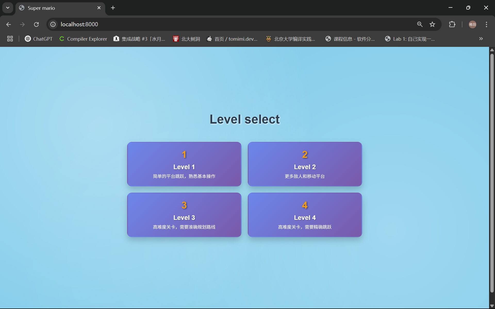
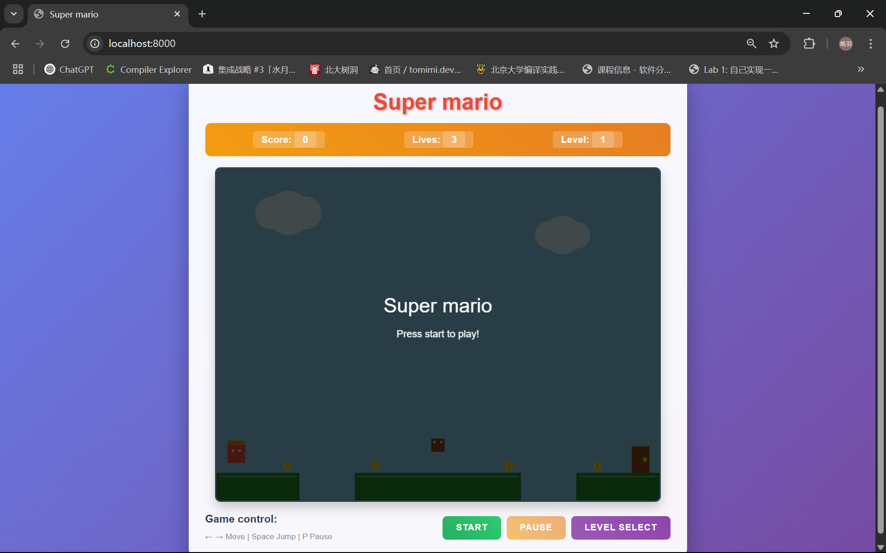
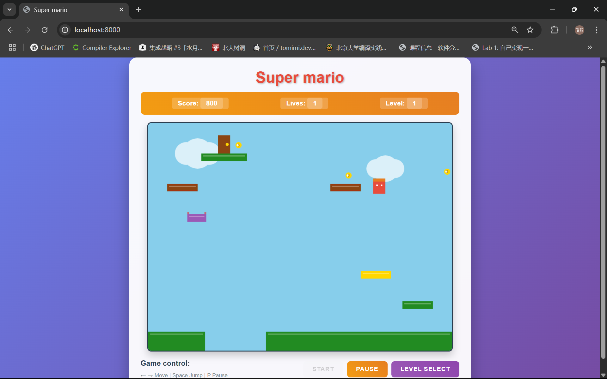
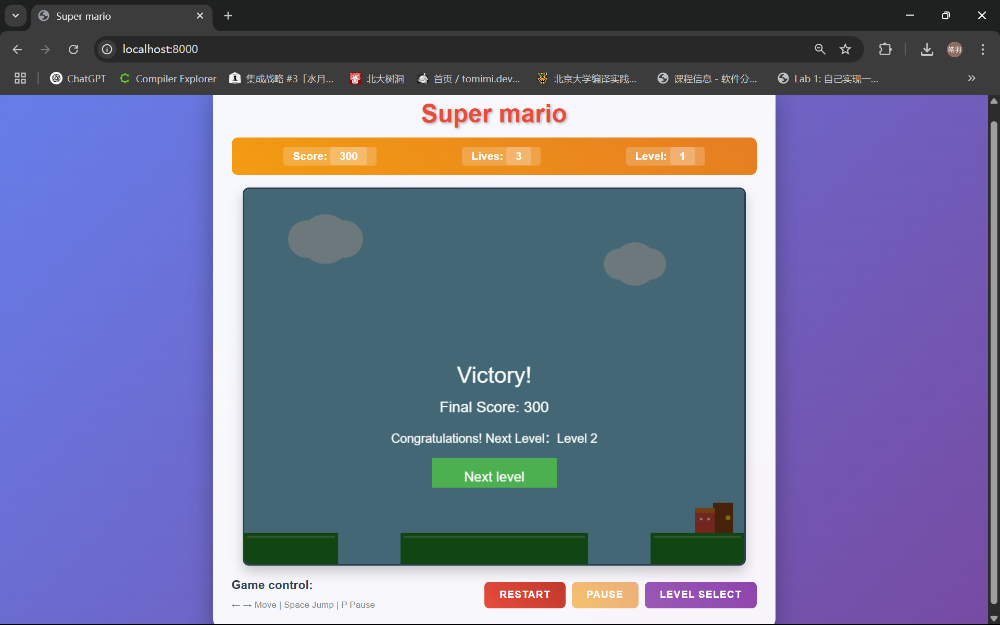

# 《JavaScript语言Web程序设计》 课程实践报告

**本项目 `Super_Mario_JS` 由小组成员合作完成，Github 仓库地址如下：[Super_Mario_JS](https://github.com/your-username/Super_Mario_JS)**

小组成员：安锐博、于宏平

### 如何运行项目

有两种方式：
- 下载所有文件到本地文件夹，用浏览器打开 "index.html" 文件即可开始游戏
- 使用本地服务器运行项目：先在 bash 中使用 python 指令 `python -m http.server 8000` 或使用 `Node.js` 指令 `npx http-server`，接下来打开浏览器访问 `http://localhost:8000` 即可开始游戏

### 概览

本项目利用 `JavaScript` 语言完成了经典游戏 `Super Mario` 的简易复刻，整体代码量在 2000 行左右。
我们采用了原生 `JavaScript` 进行开发，结合模块化设计。原生 `JavaScript` 开发具有轻量级、无依赖、性能优秀等良好特性。我们为完成本项目，主要进行了如下工作：
- 学习了浏览器中的图形渲染技术，掌握了 2D 游戏开发的基本原理。
- 利用 `JavaScript` 面向对象编程，实现了完整的游戏架构，包括游戏状态管理、输入处理、碰撞检测、物理引擎等核心模块。
- 设计了模块化的代码结构，实现了游戏实体系统、渲染引擎、关卡配置系统等。

### 项目结构说明
```
Super_Mario_JS/
├── index.html              # 主入口文件
├── style.css
└── js/
    ├── Game.js             # 游戏主控制器
    ├── GameState.js        # 游戏状态管理
    ├── InputManager.js     # 输入管理
    ├── Renderer.js         # 渲染
    ├── constants.js        # 游戏常量配置
    ├── levels.js           # 关卡配置
    ├── LevelSelect.js      # 关卡选择界面
    ├── utils.js            # 工具函数
    └── entities/           # 游戏实体模块
        ├── Player.js       # 角色实体
        ├── Platform.js     # 平台实体
        ├── Enemy.js        # 敌人实体
        ├── Coin.js         # 金币实体
        └── Door.js         # 门实体
```

项目结构中 `js` 文件夹包含了游戏的所有核心逻辑，其中 `entities` 文件夹包含了所有游戏实体的实现，每个实体都是独立的类，具有自己的属性和方法。

### 项目界面

#### 主菜单

游戏的主菜单（即关卡选择界面）和游戏主界面采用 HTML 和 CSS 实现，通过 `JavaScript` 控制界面状态。主菜单包含游戏标题、关卡选择，以网格形式展示所有可游玩关卡，每个关卡显示其对应的名称和描述信息。游玩界面的上方包括标题、得分、剩余生命数、关卡编号，中间是主体画面，下方有玩法介绍、三个按钮。这三个按钮分别对应开始游戏/重新开始、暂停/继续、关卡选择功能。

游戏的主菜单和游戏主界面示意图如下：
<div style="display:flex; gap:20px; justify-content:center">


</div>

#### 游戏主界面

1. 游戏主界面使用浏览器渲染，包含以下元素：
- 背景：游戏主体的背景是简约朴素的蓝天白云，远观之令人舒心，游玩之使人惬意；
- 元素：几乎所有游戏元素的渲染都是基于矩形的，少量元素如硬币和白云的渲染是通过先画出弧形轮廓再填充中间的色块来实现。
2. 游玩过程中，金币、敌人、碎裂平台这类会消失的实体在消失时会展现出渐变的消失效果。具体而言，当一个实体被判定为死亡时，会增加其 frame 计数，并在渲染时根据 frame 计数的值设置透明度直至消亡。
3. 关卡成功通关后，会在画面中央显示 "Victory!" 并展示所得分数，同时还会出现按钮提示是否进入下一关，此时可以选择直接进入下一关或点击 "restart" 按钮重新游玩本关。

游戏界面和通关界面示意图如下：
<div style="display:flex; gap:20px; justify-content:center">


</div>

### 游戏核心逻辑

本游戏的核心逻辑与经典的 2D 平台跳跃游戏超级马里奥一致，玩家控制角色在平台上移动、跳跃，收集金币，躲避敌人并尝试击败它们，最终到达出口完成关卡。

#### 物理系统

游戏实现了基本的物理系统：
- 重力：对玩家和敌人应用了重力加速度，当悬空时会持续加速下落
- 跳跃：玩家在地面和平台上时可以跳跃。特别地，在黄色的跳跃平台上时会自动以恒定力度起跳，起跳时还会使跳跃平台周围发出黄色光芒。玩家的跳跃力度可以在通过修改 constants.js 文件中的 GAME_CONFIG.JUMP_FORCE 属性自由设定
- 摩擦力：在地面和平台上时玩家会受到摩擦力，具体表现为移动速度为悬空时的 0.8 倍
- 碰撞检测：基于矩形边界检测和速度方向判定

#### 游戏实体

游戏实体主要包括：玩家、平台、敌人、门和金币。每种游戏实体都有自己的 `draw` 函数，用于在渲染器渲染时调用。例如：玩家、平台、敌人、门的 `draw` 是根据自身坐标绘制矩形；金币的 `draw` 是绘制弧形等。

- 玩家(Player)：用户实际操纵的角色，根据自身坐标、速度及状态每帧进行更新
- 平台(Platform)：可以支撑玩家和敌人的实体，具有不同功能，根据自身类型每帧更新
- 敌人(Enemy)：会对玩家造成伤害的实体，分为 GOOMBA 和 KOOPA，根据自身类型及状态每帧更新，会进行边界检测与死亡动画播放
- 金币(Coin)：用于玩家收集的实体，每帧播放静止时动画，在与玩家碰撞后收集
- 门(Door)：标识通关目标，与玩家碰撞后切换游戏状态，完成本关

#### 关卡系统

游戏包含多个关卡，每个关卡通过配置文件定义，配置文件中主要定义了各个实体的基本属性，包括玩家、平台、敌人、门和金币。

例如，第一关的配置：
```javascript
{
    name: "Level 1",
    description: "简单的平台跳跃，熟悉基本操作",
    platforms: [
        { x: 0, y: 550, width: 150, height: 50, type: 'normal' },
        { x: 250, y: 550, width: 300, height: 50, type: 'normal' }
    ],
    enemies: [
        { x: 400, y: 500, type: 'goomba' }
    ],
    coins: [
        { x: 120, y: 530 },
        { x: 280, y: 530 }
    ],
    playerStart: { x: 20, y: 500 },
    doorPosition: { x: 750, y: 502 }
}
```
关卡的设计循序渐进，逐渐让玩家体会到游戏的不同机制，难度也递增。所有关卡配置内容均存放在 `levels.js` 文件中，与逻辑控制代码和实体代码分离，提高可扩展性与可维护性，便于后续开发。

### 技术实现细节

#### 主循环

游戏采用 `requestAnimationFrame` 函数达成每帧调用一次的循环：
```javascript
gameLoop(currentTime) {
    ...
    requestAnimationFrame((time) => this.gameLoop(time));
}
```

在每次循环中，依次完成处理输入、更新实体状态、渲染的工作。由于每帧调用一次，感官上就像在连续运行。

#### 输入处理

输入管理器 `InputManager` 利用 `js` 原生的 `eventListener` 处理键盘事件，主要包括：
- 方向键/WASD：移动控制（左右）
- 空格键：跳跃
- P 键：暂停游戏

#### 碰撞检测

为简便处理，游戏中的碰撞箱均为矩形，碰撞检测本身通过 `utils.js` 中的 `checkCollision` 函数完成。此外，在处理玩家和怪物、平台的碰撞时，还需要考虑碰撞的位置与速度的方向，这些处理在 `Game.js` 的 `handleXXXCollisions` 函数中，它们结合具体的角色属性与状态进行判断。

### 总结与展望

本项目主要利用 `JavaScript` 语言，在浏览器端完成了类似于超级马里奥的简易平台跳跃游戏。在开发过程中我们实际使用到了现代 `JavaScript` 的诸多特性，例如模块化、事件监听等，也用到了许多软件开发的设计模式，如数据与逻辑分离符合软件设计的开放封闭原则，这都给游戏的实际开发带来了便利。

`JavaScript` 语言具有良好的浏览器接口，能够方便地统一浏览器事件处理和图像渲染的工作，因而这也让我们体会到利用 `JavaScript` 语言在浏览器应用开发中的重要作用。

此外，合作项目也带来挑战，需要小组内成员明确规划设计，加强沟通合作，合理分配工作，在合作中必不可少。这样才能最大化地提高多人合作的开发效率，达到 1 + 1 > 2 的效果。

## 近期生活照


本学期出勤次数大约在 7 次左右，出勤次数较少的主要原因包括：
- 早八上课起床困难。如果在早上七点左右起床参与课程，需要在下课后补觉，且精神状态不佳，不利于一整天的学习生活。我也已经在试卷上表达该建议，希望以后调整课程时间。
- 课程节奏较慢，通过回放倍速（1.5至2倍速）学习效果较佳，可以有效进行知识学习。